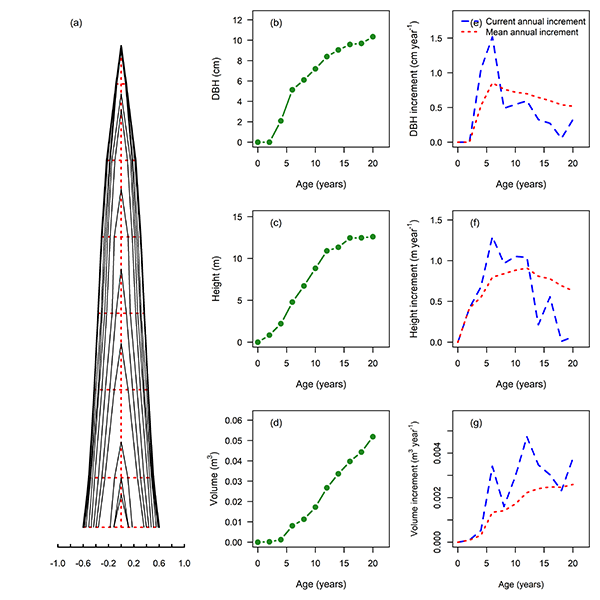

## Abstract
#### StemAnalysis R package is a tool for designed to reconstruct stem growth profiles, construct height-diameter relationships, and consequently to compute growth trends in terms of diameter at breast height (DBH), tree height, stem volume, tree biomass and carbon storage for an individual tree. This vignette provides an overview of this package functions and options. We provide a working examples that demonstrates the basic functionality and use of the package.

## Purpose
#### Accurate information about age dynamics of timber production and carbon storage in forest ecosystems is frequently required by scientists, stakeholders, and policymakers. Stem analysis is a technique for measuring tree growth (Salas-Eljatib, 2021). The computational burden of reconstructing temporal, radial, and longitudinal patterns of tree growth, fitting height-diameter relationships, and calculating outside-bark diameter from radial annual-ring increment sequences measured on multiple cross-sectional discs, may present a hindrance to application of stem analysis methodology in forest research investigations and operational forest multifunctional management (Newton, 2019). Therefore, a standardized tool, StemAnalysis R package, is developed to calculate tree growth dynamics and then make the stem analysis technique more conveniently applied to forest multifunctional investigation.


```{r, setup, include=FALSE}
knitr::opts_chunk$set(comment = "#>")
require(knitr)
require(StemAnalysis)
```


# 1. Installation

```{r, eval=FALSE}
install.packages("StemAnalysis")
```

# 2. Load the package

```{r, eval=FALSE}
require(StemAnalysis)
require(knitr) # To input tables in this document
```

# 3. Load the stem analysis data stored in the package
#### stemdata is a dataset containing the input data of stem analysis. Note: If a user uses the StemAnalysis package to analysis a very big tree, the number of inner growth rings that diameter measured for some cross-sectional discs may be more than 11, the Dnobark12, Dnobark13, and much more variables can be added, which also could successfully run.

```{r, eval=TRUE, cache=TRUE}
data(stemdata)
str(stemdata)
```
### The list of input variables and their description in stemdata dataset
#### No: The line number
#### Treeno: The tree number for the sampled tree, the same number represents the same tree
#### TreeTH: Tree total height (m)
#### stemheight: The stem height that the cross-sectional discs were obtained (m). The detail information see Figure 1
#### stemage: The age at the stem height, namely the number of growth rings of the cross-sectional disc (year)
#### Dwithbark: The maximum outside-bark diameter of  the cross-sectional disc (cm)
#### Dnobark0: The maximum inside-bark diameter of the cross-sectional disc without bark (cm)
#### Dnobark1: The diameter for the 1th age class inner growth ring of the cross-sectional disc (cm). The detail information see Figure 2
#### Dnobark2: The diameter for the 2th age class inner growth ring of the cross-sectional disc (cm)
#### Dnobark3: The diameter for the 3th age class inner growth ring of the cross-sectional disc (cm)
#### Dnobark4: The diameter for the 4th age class inner growth ring of the cross-sectional disc (cm)
#### Dnobark5: The diameter for the 5th age class inner growth ring of the cross-sectional disc (cm)
#### Dnobark6: The diameter for the 6th age class inner growth ring of the cross-sectional disc (cm)
#### Dnobark7: The diameter for the 7th age class inner growth ring of the cross-sectional disc (cm)
#### Dnobark8: The diameter for the 8th age class inner growth ring of the cross-sectional disc (cm)
#### Dnobark9: The diameter for the 9th age class inner growth ring of the cross-sectional disc (cm)
#### Dnobark10: The diameter for the 10th age class inner growth ring of the cross-sectional disc (cm)
#### Dnobark11: The diameter for the 11th age class inner growth ring of the cross-sectional disc (cm)

# 4. Load the allompardata dataset stored in the package
#### Tree biomass estimated using allometric models [ln(B)=ln(a)+b×ln(DBH)+c×ln(H)] (National Forestry and Grassland Administration, 2014). The allompardata dataset, including parameters a, b, c, and carbon concentration for tree aboveground and belowground, are optional inputs.

```{r, eval=TRUE, cache=TRUE}
data(allomPardata)
str(allomPardata)
```
### The list of input variables and their description in allomPardata dataset
#### DBH: The tree diameter at breast height, DBH<5 indicate that DBH is <5 cm, DBH>5 indicate that DBH is >=5 cm
#### tissues: The tree tissues including aboveground and belowground components
#### a: The parameter a in the allometric model ln(B)=ln(a)+b×ln(DBH)+c×ln(H)
#### b: The parameter b in the allometric model ln(B)=ln(a)+b×ln(DBH)+c×ln(H)
#### c: The parameter c in the allometric model ln(B)=ln(a)+b×ln(DBH)+c×ln(H)
#### Cconcentration: The carbon concentration in each tree tissues (kg C kg-1)

# 5. Load the biomass conversion factor data stored in the package
#### Total tree biomass estimated using volume model [V×BCF×(1+RSR)] (IPCC, 2003). The biomass conversion factor data, including parameters a, b, and c for Biomass Conversion Factor (BCF) and Root-to-Shoot ratio (RSR), as well as total tree C concentration, are optional inputs.

```{r, eval=TRUE, cache=TRUE}
data(volumePardata)
str(volumePardata)
```
### The list of input variables and their description in volumePardata dataset
#### DBH: The tree diameter at breast height, DBH<5 indicate that DBH is <5 cm, DBH>5 indicate that DBH is >=5 cm
#### factors: The tree biomass estimation factors including BCF and RSR
#### BCF: The Biomass Conversion Factor, the estimation model is ln(BCF)=ln(a)+b×ln(DBH)+c×ln(H)
#### RSR: The Root-to-Shoot Ratio, , the estimation model is ln(RSR)=ln(a)+b×ln(DBH)+c×ln(H)
#### a: The parameter a in the estimation model of BCF and RSR
#### b: The parameter b in the estimation model of BCF and RSR
#### c: The parameter c in the estimation model of BCF and RSR
#### Cconcentration: The total tree carbon concentration (kg C kg-1)

# 6. Application of StemAnalysis package
## 6.1 Stem growth analysis
#### Reconstructed stem growth patterns and calculated DBH and tree height growth trends, and outside-bark stem volume increment trends using stem analysis data. 
```{r, eval=TRUE, cache=TRUE}
stemgrowth <- stemanalysism(xtree = 8, stemgrowth = TRUE, stemdata = stemdata)
knitr::kable(stemgrowth)
```
#### Table 1 The tree age chronosequence and the corresponding growth data of DBH, stem height, and stem volume. stemdj is the age class of a tree growths (year); DBHt is the tree diameter at breast height (cm); Height is the tree height (m); Volume is the tree stem volume (m3); AnincreD is the mean annual increment of diameter at breast height (cm); AvincreD is the current annual increment of diameter at breast height (cm); AnincreH is the mean annual increment of tree height (m); AvincreH is the current annual increment of tree height (m); AnincreV is the mean annual increment of tree stem volume (m3); AvincreV is the current annual increment of tree stem volume (m3).

```{r, echo=FALSE, out.width="80%"}

```

#### Figure 3 Stem growth patterns of an individual tree. (a) shows the stem growth pattern; (b), (c), and (d) are the cumulative growth and (e), (f), and (g) are the mean annual increment (red dotted line) and current annual increment (blue dashed line) of DBH, tree height, and stem volume, respectively.

## 6.2 Estimation Of tree carbon accumulation
### 6.2.1 Tree biomass and carbon accumulation estimated by allometric models
#### If set 'treecarbon = TRUE' and provide allompardata data, tree biomass and carbon accumulation estimated by allometric models.

```{r, eval=TRUE, cache=TRUE}
allomcarbon <- stemanalysism(xtree = 8, treecarbon = TRUE, stemdata = stemdata, allompardata = allomPardata)
knitr::kable(allomcarbon)
```
#### Table 2 The stem growth data (the same to Table 1) and tree biomass and carbon storage that estimated by allometric models. treeage is the age class of a tree growths (year); abovegroundB is the aboveground biomass of a sampled tree (kg); belowgroundB is the belowground biomass of a sampled tree (kg); totalB is the total tree biomass of a sampled tree (kg); abovegroundC is the aboveground carbon storage of a sampled tree (kg); belowgroundC is the belowground carbon storage of a sampled tree (kg); totalC is the total tree carbon storage of a sampled tree (kg).
 

```{r, echo=FALSE, out.width="120%"}

```

#### Figure 4 The age dynamics of total tree biomass (a) and carbon storage (b) for the 20-year-old Chinese fir tree estimated using allometric models.

### 6.2.2 Tree biomass and carbon accumulation estimated by volume model
#### If set 'treecarbon = TRUE' and provide biomass conversion factor data, tree biomass and carbon accumulation estimated by volume model.

```{r, eval=TRUE, cache=TRUE}
volumecarbon <- stemanalysism(xtree = 8, treecarbon = TRUE, stemdata = stemdata, volumepardata = volumePardata)
knitr::kable(volumecarbon)
```
#### Table 3 The stem growth data (the same to Table 1) and tree biomass and carbon storage that estimated by volume model. treeage is the age class of a tree growths (year); BCF is the estimated Biomass Conversion Factor; RSR is the estimated Root-to-Shoot Ratio; abovegroundB is the aboveground biomass of a sampled tree (kg); belowgroundB is the belowground biomass of a sampled tree (kg); totalB is the total tree biomass of a sampled tree (kg); abovegroundC is the aboveground carbon storage of a sampled tree (kg); belowgroundC is the belowground carbon storage of a sampled tree (kg); totalC is the total tree carbon storage of a sampled tree (kg).

```{r, echo=FALSE, out.width="120%"}
knitr::include_graphics("../man/Figures/TreeCarbon_volume.png")
```

#### Figure 5 The age dynamics of total tree biomass (a) and carbon storage (b) for the 20-year-old Chinese fir tree estimated using volume model.

## 6.3 Construction of height-diameter relationship
#### If set 'HDmodel = TRUE', tree height-diameter relationship will be constructed by nonlinear models, and the fitted statistics are showed in a graph.

```{r, eval=FALSE, cache=TRUE}
stemgrowth <- stemanalysism(xtree = 8, HDmodel = TRUE, stemdata = stemdata)
```

```{r, echo=FALSE, out.width="60%"}
knitr::include_graphics("../man/Figures/HDmodel.png")
```

#### Figure 6 Tree height-diameter relationships for the 20-year-old Chinese fir tree. The fitted curves of the Chapman-Richards model (red line), Logistic model (blue line), Weibull model (green line), and Gomperz model (yellow line) as well as their fitted statistics. a, b and C are the parameters of the nonlinear models; R2 is the coefficient of determination; RSS is the residual sum of squares; AIC is the akaike information criterion; logLik is the  Log-Likelihood value.

# References
#### IPCC. (2003) Good Practice Guidance for Land Use, Land-Use Change and Forestry; IPCC/IGES: Hayama, Japan.

#### Newton, P.F. (2019) Examining naturogenic processes and anthropogenic influences on tree growth and development via stem analysis: data processing and computational analytics. Forests 10, 1058.

#### Salas-Eljatib, C. (2021) A new algorithm for reconstructing the height growth with stem analysis data. Methods Ecol. Evol. 12, 2008–2016.

#### National Forestry and Grassland Administration. (2014) Tree biomass models and related parameters to carbon accounting for Cunninghamria lanceolata. Forestry industry standards of the People's Republic of China, Beijing, LY/T 2264—2014.
