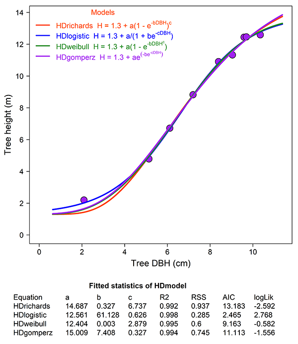

# Abstract
StemAnalysis R package is a tool for designed to reconstruct stem growth profiles, construct height-diameter relationships, and consequently to compute growth trends in terms of diameter at breast height (DBH), tree height, stem volume, tree biomass and carbon. This vignette provides an overview of this package functions and options. We provide a working examples that demonstrates the basic functionality and use of the package.

# Purpose
Accurate information about age dynamics of timber production and carbon storage in forest ecosystems is frequently required by scientists, stakeholders, and policymakers. Stem analysis is a technique for measuring tree growth (Salas-Eljatib, 2021). The computational burden of reconstructing temporal, radial, and longitudinal patterns of tree growth, fitting height-diameter relationships, and calculating diameter with bark from radial annual-ring increment sequences measured on multiple cross-sectional discs, may present a hindrance to application of stem analysis methodology in forest research investigations and operational forest multifunctional management (Newton, 2019). Therefore, a standardized tool, StemAnalysis R package, is developed to calculate tree growth dynamics and then make the stem analysis technique more conveniently applied to forest multifunctional investigation.


```{r, setup, include=FALSE}
knitr::opts_chunk$set(comment = "#>")
require(knitr)
require(StemAnalysis)
```


# Installation

```{r, eval=FALSE}
install.packages("StemAnalysis")
```

# Load the package

```{r, eval=FALSE}
require(StemAnalysis)
require(knitr) # To input tables in this document
```

# Load the stem analysis data stored in the package
Stem analysis data, including stem height (m), age (year), diameter (with and without bark) as well as inner ring diameter (cm) of the ith disc with sequences from the ground to the tip ordered by increasing height, are required inputs.

```{r, eval=TRUE, cache=TRUE}
data(stemdata)
str(stemdata)
```

# Load the parameter data stored in the package
Tree biomass estimated using allometric models [ln(Bi)=βi0+βi1×ln(DBH^2H)] (Xiang et al., 2021). The Parameter data, including parameters a (βi0), b (βi1), and C concentration for each tissues, are optional inputs.

```{r, eval=TRUE, cache=TRUE}
data(parameterdata)
str(parameterdata)
```

# Load the biomass expansion factor data stored in the package
Total tree biomass estimated using volume model [V*WD*BEF*(1+R)] (IPCC, 2003). The biomass expansion factor data, including wood density (WD), biomass expansion factor (BEF), root:shoot ratio (R), and C concentration, are optional inputs.

```{r, eval=TRUE, cache=TRUE}
data(BEFdata)
str(BEFdata)
```


# Application of StemAnalysis package
## 1. Stem growth analysis
Reconstructed stem growth patterns and calculated DBH and tree height growth trends, and stem volume with bark increment trends using stem analysis data.   

```{r, eval=TRUE, cache=TRUE}
stemgrowth <- stemanalysism(xtree = 8, stemgrowth = TRUE, stemdata = stemdata)
knitr::kable(stemgrowth)
```

```{r, echo=FALSE, out.width="120%"}
knitr::include_graphics("../man/Figures/StemGrowth.png")
```

## 2. Estimation Of tree carbon accumulation
If set 'treecarbon = TRUE' and provide parameter data, tree biomass and carbon accumulation estimated by allometric models.

```{r, eval=TRUE, cache=TRUE}
allomcarbon <- stemanalysism(xtree = 8, treecarbon = TRUE, stemdata = stemdata, parameterdata = parameterdata)
knitr::kable(allomcarbon)
```

```{r, echo=FALSE}
knitr::include_graphics("../man/Figures/TreeCarbon_allometric.png")
```

If set 'treecarbon = TRUE' and provide biomass expansion factor data, tree biomass and carbon accumulation estimated by volume model.

```{r, eval=TRUE, cache=TRUE}
volumecarbon <- stemanalysism(xtree = 8, treecarbon = TRUE, stemdata = stemdata, BEFdata = BEFdata)
knitr::kable(volumecarbon)
```

```{r, echo=FALSE}

```

## 3. Construction of height-diameter relationship
If set 'HDmodel = TRUE', tree height-diameter relationship will be constructed by nonlinear models, and showed the best fit model in a graph.

```{r, eval=FALSE, cache=TRUE}
stemgrowth <- stemanalysism(xtree = 8, HDmodel = TRUE, stemdata = stemdata)
```

```{r, echo=FALSE}

```


# References
IPCC. (2003) Good Practice Guidance for Land Use, Land-Use Change and Forestry; IPCC/IGES: Hayama, Japan.

Newton, P.F. (2019) Examining naturogenic processes and anthropogenic influences on tree growth and development via stem analysis: data processing and computational analytics. Forests 10, 1058.

Salas-Eljatib, C. (2021) A new algorithm for reconstructing the height growth with stem analysis data. Methods Ecol. Evol. 12, 2008–2016.

Xiang, W.H., Li, L.H., Ouyang, S., Xiao, W.F., Zeng, L.X., Chen, L., Lei, P.F., Deng, X.W., Zeng, Y.L., Fang, J.P. & Forrester, D.I. (2021) Effects of stand age on tree biomass partitioning and allometric equations in Chinese fir (Cunninghamia lanceolata) plantations. Eur. J. For. Res. 140, 317–332.
